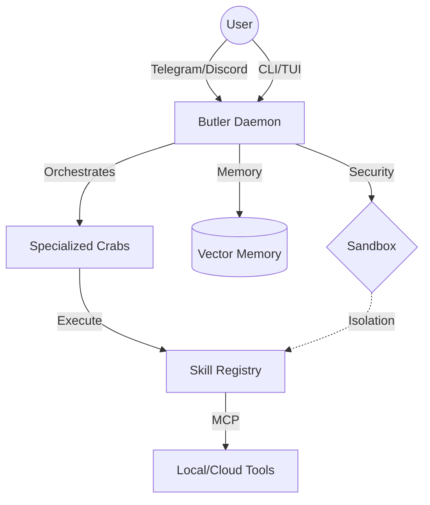

# 🦀 AURACRAB

<p align="center">
  
  <br>
  <b>The Autonomous Digital Butler for the Agentic Era.</b>
  <br>
  <i>Persistent. Proactive. Powerful.</i>
</p>

> [!IMPORTANT]
> Auracrab is a core component of the **[vibeauracle](https://github.com/nathfavour/vibeauracle)** Go CLI ecosystem. It leverages **vibeauracle**'s advanced intelligence layer for repository-wide analysis, Copilot SDK planning, and multi-agent coordination.

<p align="center">
  <a href="https://github.com/nathfavour/auracrab/actions/workflows/release.yml"></a>
  <a href="https://go.dev"></a>
  <a href="https://discord.gg/auracrab"></a>
</p>

---

## 📺 The Interface

Auracrab features a stunning, high-fidelity TUI built with **Charm Bracelet** tools. Monitor your tasks, check system vibes, and manage your Crabs in real-time.

```text
🦀 AURACRAB  v1.0.0 - AGENTIC DAEMON

DELEGATED TASKS                 SYSTEM VIBES
-----------------------         -----------------------
⏳ task_1706352000              Health: Excellent
   Security audit...            Status: 1 active, 12 done

✅ task_1706351000              LOADED SKILLS
   Update dependencies...       • browser
                                • social
❌ task_1706350000              • autocommit
   Deploy to prod...            • system

[↑/↓] Navigate • [r] Refresh • [q] Quit • [v] View Output
```

## 🌊 The Vision

**Auracrab** is not just another CLI tool. It is an **autonomous, persistent AI agent daemon** built in Go, designed to act as your proactive "Digital Butler." It lives in your system, watches your vibes, and executes complex multi-step tasks while you sleep.

Whether it's auditing your security, managing your social presence, or self-healing your development environment, Auracrab handles it with **Thought Signatures**—maintaining deep context across sessions.

## ✨ Core Pillars

| 🧠 **Memory** | 🐙 **Orchestration** | 🛡️ **Security** |
| :--- | :--- | :--- |
| Long-term vector storage for permanent context retrieval. | Multi-agent coordination via Copilot SDK & AgentKit. | Go-native sandboxing with system-level isolation. |

## 🛠️ Key Features

<details>
<summary><b>🦀 Specialized Crabs</b></summary>
Register user-defined agents with custom instructions and specialized skillsets.
</details>

<details>
<summary><b>📡 Messaging-First</b></summary>
Control your butler via <b>Telegram</b> or <b>Discord</b>. Send a task on the go, and Auracrab handles the rest.
</details>

<details>
<summary><b>🩺 Live Health Monitoring</b></summary>
Real-time analysis of system logs and automated "doctor" recovery using Gemini Multimodal Live API.
</details>

<details>
<summary><b>🧩 MCP Native</b></summary>
Full support for the <b>Model Context Protocol</b> to bridge agents with local and cloud-based tools.
</details>

<details>
<summary><b>⚡ Vibe Mode</b></summary>
Direct integration with <code>vibeauracle</code> for high-fidelity intelligence and thought signatures.
</details>

## 🚀 Getting Started

### Installation

**Via Shell (Recommended):**
```bash
curl -sSL https://raw.githubusercontent.com/nathfavour/auracrab/main/install.sh | bash
```

**Via Go:**
```bash
go install github.com/nathfavour/auracrab/cmd/auracrab@latest
```

### Quick Commands

| Command | Action |
| :--- | :--- |
| `auracrab start` | Spin up the butler daemon |
| `auracrab vibe` | Enter the interactive TUI |
| `auracrab crab list` | View your specialized agents |
| `auracrab vault set` | Securely store API secrets |

## 🏗️ Architecture



Auracrab follows a modular, plugin-based architecture:

- **Agent Engine**: Orchestrates hybrid model strategies.
- **Connector Registry**: Centralized hub for SaaS and messaging integrations.
- **Skill Registry**: Extensible toolsets (Browser, Social, Auto-Commit, etc.).
- **Vault**: Secure storage for sensitive API keys and credentials.

> [!TIP]
> Check out [ARCHITECTURE.md](./ARCHITECTURE.md) for a deep dive into the internals.

---

<p align="center">
  Built with ❤️ by <a href="https://github.com/nathfavour">Nath Favour</a> and the Auracrab Community.
  <br>
  <i>"Stay crabby, stay productive."</i>
</p>
