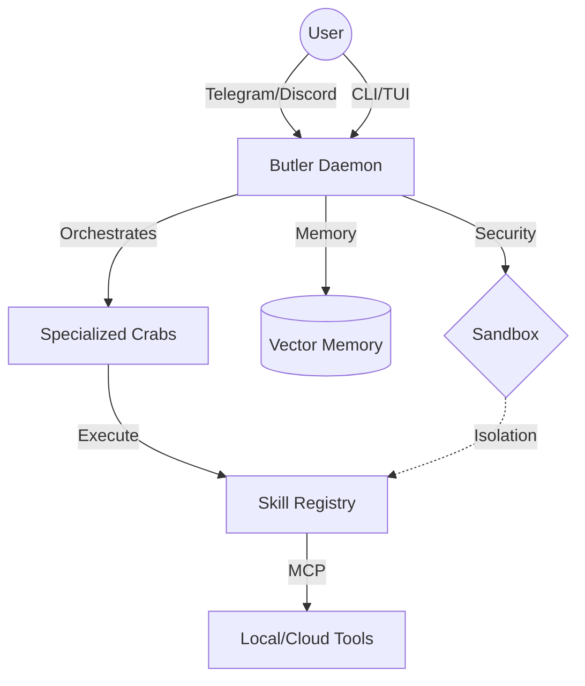

# Architecture

Auracrab is built with a modular, plugin-based architecture designed for persistence, security, and extensibility. It operates as a background daemon that orchestrates various "skills" and specialized "crabs".

## System Overview

### Core Components

#### 1. Butler Daemon
The central orchestrator that stays resident in memory. It manages the message queue, task execution, and skill lifecycle. It communicates with users via CLI, TUI, or messaging platforms like Telegram and Discord.

#### 2. Skill Registry
A collection of executable tools that the agent can use.
- **Browser Skill**: Native browser automation via a WebSocket bridge to a browser extension.
- **Social Skill**: Integration with platforms like Twitter, Telegram, and Discord.
- **System Skill**: Local file system and command execution.
- **Vault Skill**: Secure management of API keys and secrets.

#### 3. Browser WebSocket Bridge
A unique component that connects the Go backend to a user's actual browser session.
- **Backend**: `pkg/connect/browser.go` manages WebSocket connections from browser extensions.
- **Extension**: A WXT-based extension (`webuse/`) that executes commands like `click`, `type`, and `scrape` in the user's active tab.

#### 4. Memory & Context
- **Ephemeral Memory**: Short-term session context.
- **History Store**: Persistent conversation logs.
- **Vector Memory**: Long-term storage for retrieval-augmented generation (RAG).

#### 5. Security Sandbox
All high-risk commands (like shell execution) are routed through a sandboxing layer to ensure system integrity.

## Directory Structure

- `cmd/`: Entry points for the `auracrab` CLI.
- `pkg/connect/`: WebSocket and messaging platform connectors.
- `pkg/skills/`: Implementation of agent capabilities.
- `pkg/core/`: The `Butler` and task management logic.
- `webuse/`: Source code for the browser extension.
